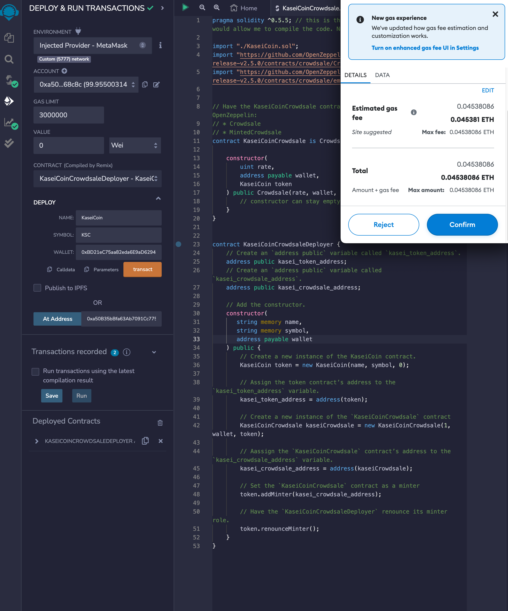
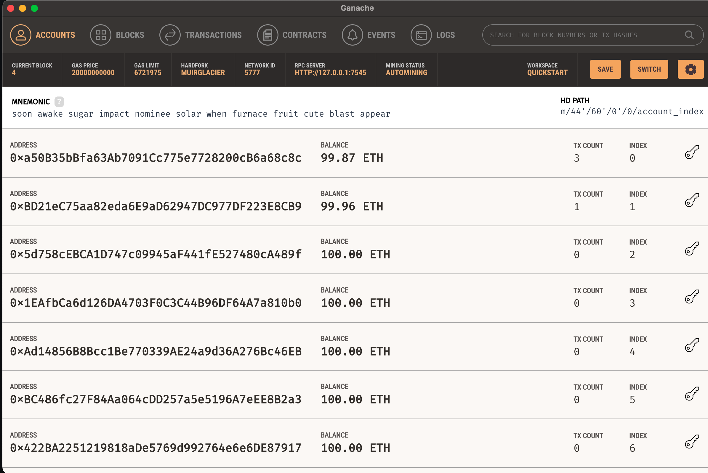

# Crypto Crowdsale Demo

This program utlizes MetaMask, Ganache, and RemixIDE to showcase a blockchain crowdsale

---

## Technologies

This project leverages Solidity with the following packages/technologies:

* [OpenZepplin](https://github.com/OpenZeppelin/) - The standard for secure blockchain applications

* [Ganache](https://trufflesuite.com/ganache/) - Ethereum blockchain which you can use to run tests, execute commands, and inspect state while controlling how the chain operates

* [MetatMask](https://metamask.io/) - Equips you with a key vault, secure login, token wallet, and token exchange

---

## Installation Guide

Before running the application, create an account on MetaMask and connect it to your local Ganache instance

---

## Examples

---

## Usage

To use the this solidity program, first open Ganache and start a temporary workspace. Copy your instance IP address and add it to a .env file in the root directory (e.g. WEB3_PROVIDER_URI = "HTTP://127.0.0.1:7545")

From your Remix IDE, compile and deploy the KaseiCoinCrowdsale.sol file. You will interact with the program from the Remix interface.

---

## Contributors

Pull requests are welcome. For major changes, please open an issue first to discuss what you would like to change.

Please make sure to update tests as appropriate.

---

## License

N/A